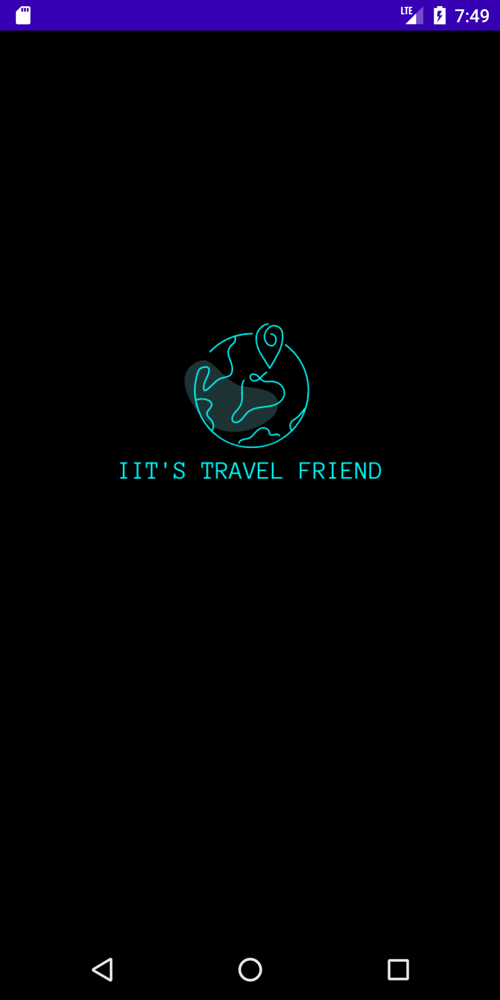
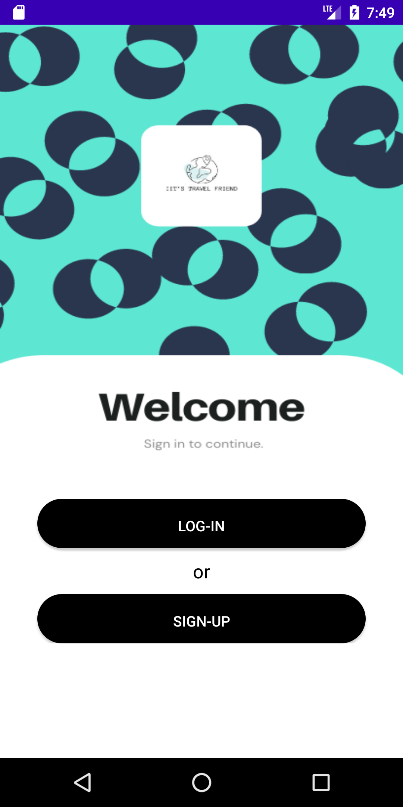
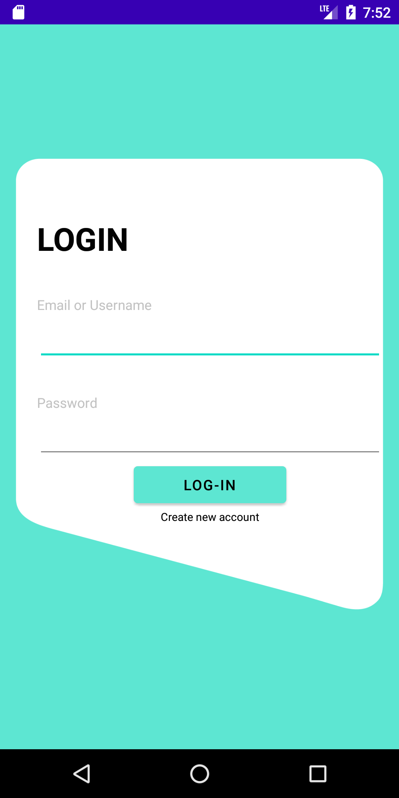
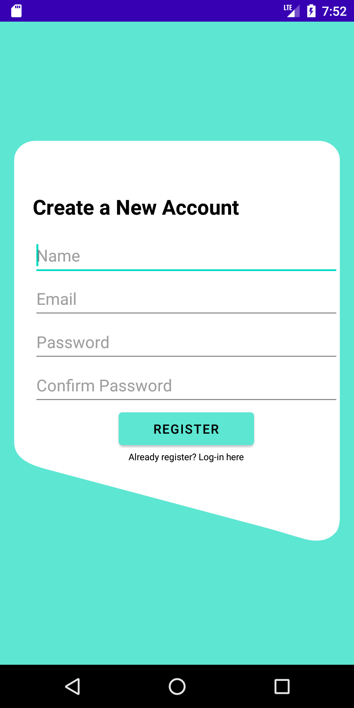
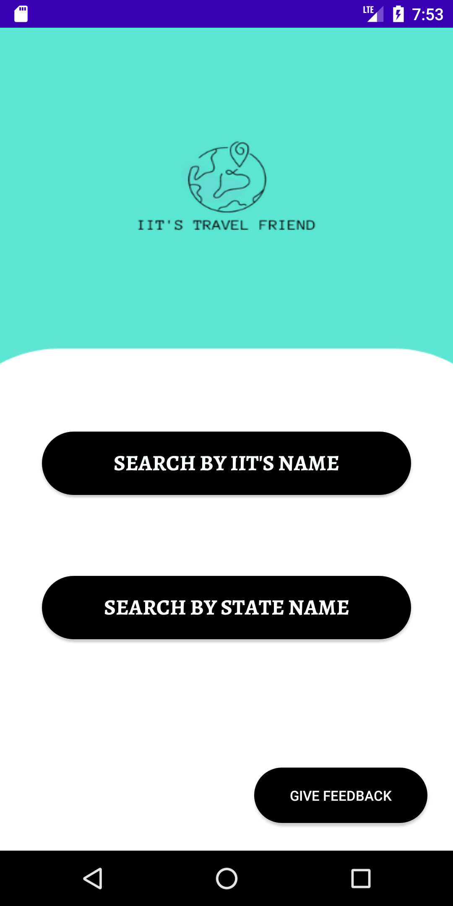
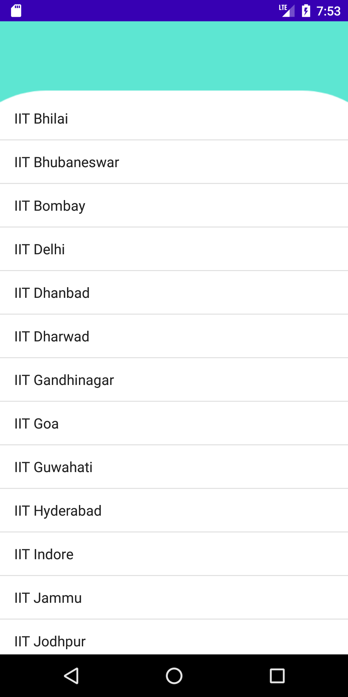
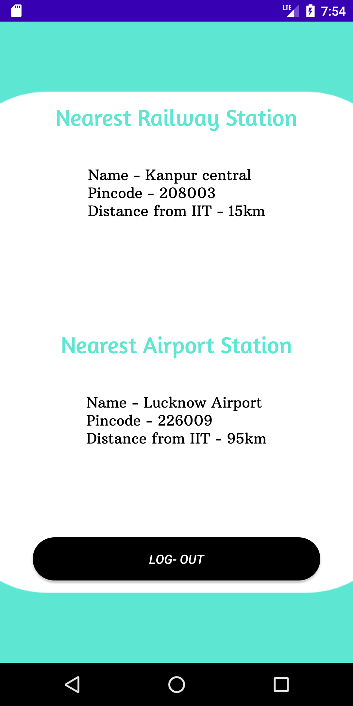

# IIT-s-Travel-Friend-2.0

This is a second version of app IITs Travel Friend

## Important Updates -

1. The entire app has been restructured with a new user-friendly and simple UI. (The one before it is a little childish)
2. Added a Splash Screen
3. Design a main page that loads before the login and sign-up windows.
4. If you press the back button, the log-in or sign-up window appears, and the problem is resolved.
5. The default navigation bar that looks bad was also removed.

## Screenshot -

  
  
  
  
  
  
  
  
  
  
  
  
